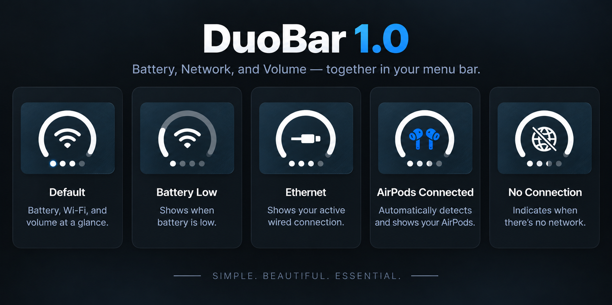

<div align="center">

# DuoBar

### One compact macOS menu bar indicator for Battery, Network, and Volume.

**Three live states. One glyph. Less menu bar clutter.**

[**Download DuoBar**](https://github.com/vibe2code/DuoBar/releases/latest) · [**Watch the Launch Film**](https://github.com/Mikeli7666/DuoBar/releases/download/v1.0.0/DuoBar-1.0-Official-Launch-Film.mp4)

macOS 13+ · Apple Silicon or Intel · Universal 2 · Free and Open Source

<br>


</div>

## One glyph, three live states

DuoBar adapts the iPhone Duo-style three-in-one status concept for the Mac menu bar. One compact glyph presents the system information normally spread across several indicators:

- **Outer arc** → a live Battery Ring on MacBooks, or an Adaptive Ring on desktop Macs
- **Center** → the active network: Wi-Fi, Ethernet, or an offline/fallback state
- **Four lower dots** → live output volume

Persistent status stays monochrome and native-looking. When AirPods or another supported Bluetooth audio output becomes active, the center briefly transitions from Network → AirPods/headphones → Network. Disconnecting does not trigger an animation.

## Adaptive Ring and Battery Ring

On MacBooks, the outer Battery Ring shows live battery level, a dynamic charging bolt, and optional battery color coding for charging, Low Power Mode, and low-battery states. On desktop Macs, Adaptive Ring shows display brightness when publicly available and automatically surfaces sustained CPU, memory, or thermal pressure when it needs attention. It remains automatic: there is no manual metric selector.

## DuoBar on macOS

DuoBar redesigns the original menu bar status around Battery, Network, and Volume. It adds full interactive pickers for Wi-Fi and Audio Output, automatic updates via Sparkle, and a native translucent macOS Settings window.

<p align="center">
  
</p>

## ✨ What's New & Key Features

- **Interactive Wi-Fi Picker:** Click on the Wi-Fi status in the popover to view available networks, signal strength, security badges, and switch networks directly.
- **Interactive Audio Output Picker:** Click on the audio device in the popover to view all Core Audio output devices and switch between them instantly.
- **Native macOS Settings Window:**
  - Redesigned tabbed interface (`General`, `Menu Bar`, `Battery & Power`, `About`, `Developer`).
  - Native macOS frosted-glass translucency and vibrancy (`NSVisualEffectView` with `.behindWindow` blending and `.ultraThinMaterial` cards).
  - Live preview of the menu bar glyph inside settings.
  - Transparent titlebar matching native macOS System Settings.
- **17 World Languages Supported:** Automatic system language detection with full localizations for:
  - English, Russian (Русский), Ukrainian (Українська), Greek (Ελληνικά), German (Deutsch), French (Français), Italian (Italiano), Spanish (Español), Portuguese (Português - Brasil), Japanese (日本語), Korean (한국어), Simplified Chinese (简体中文), Traditional Chinese (繁體中文), Arabic (العربية), Hindi (हिन्दी), Turkish (Türkçe), Polish (Polski).
- **Auto-Updater via Sparkle:** In-app update checking and seamless background updates via Sparkle framework with EdDSA signatures.
- **App Icon & Standalone Packaging:** High-resolution `AppIcon.icns` bundled into a standalone macOS application build script (`tools/build-app.sh`).
- **Battery Ring:** Live level, dynamic charging bolt, low-battery state, and optional Battery Color Coding.
- **Adaptive Ring for Desktop Macs:** Brightness baseline with automatic CPU, memory, and thermal pressure awareness.
- **Network States:** Automatic Wi-Fi, Ethernet, and offline network states.
- **Volume Control:** Four-dot live volume indicator with slider and public Core Audio mute control where supported.
- **AirPods Connection Presentation:** Dynamic glyph transition upon connecting supported Bluetooth headphones.
- **Adjustable Menu-Bar Icon Size:** Custom scaling slider with real-time preview.
- **Launch at Login:** Native `SMAppService` launch at login support with approval status checks.
- **Universal 2:** Native support for Apple Silicon (arm64) and Intel (x86_64) on macOS 13+.

## Requirements

**macOS 13.0+ (Ventura, Sonoma, Sequoia)**<br>
**Apple Silicon or Intel**

## Installation

1. Download the latest release from [GitHub Releases](https://github.com/vibe2code/DuoBar/releases).
2. Move `DuoBar.app` to your `/Applications` folder.
3. Launch DuoBar from Applications or Spotlight.
4. If macOS displays a gatekeeper warning on first launch (ad-hoc signed builds), right-click DuoBar and choose **Open**, or go to **System Settings → Privacy & Security → Open Anyway**.

## Permissions

- **Location:** macOS may require authorization before CoreWLAN can expose the current Wi-Fi network name and scan available SSIDs. Denying access does not break basic connection, interface, or signal state.
- **Bluetooth:** DuoBar observes Bluetooth controller endpoints via Core Audio to reflect active AirPods and headphones.

## Building from Source

### Using Command Line Tools (`swift build`)
You can build and bundle `DuoBar.app` without opening Xcode:

```bash
# Build release and package into build/DuoBar.app
./tools/build-app.sh
```

### Using Xcode
Open `DuoBar.xcodeproj` in Xcode, select the **DuoBar** scheme, and press **Cmd+R** to build and run.

## Privacy

- All system status processing is performed entirely locally on your Mac.
- No analytics, telemetry, or user tracking.
- Network requests are strictly limited to auto-update feeds (Sparkle) when checking for releases.

## Disclaimer

DuoBar is an independent open-source project and is not affiliated with or endorsed by Apple Inc.

## License

DuoBar is released under the [MIT License](LICENSE).
