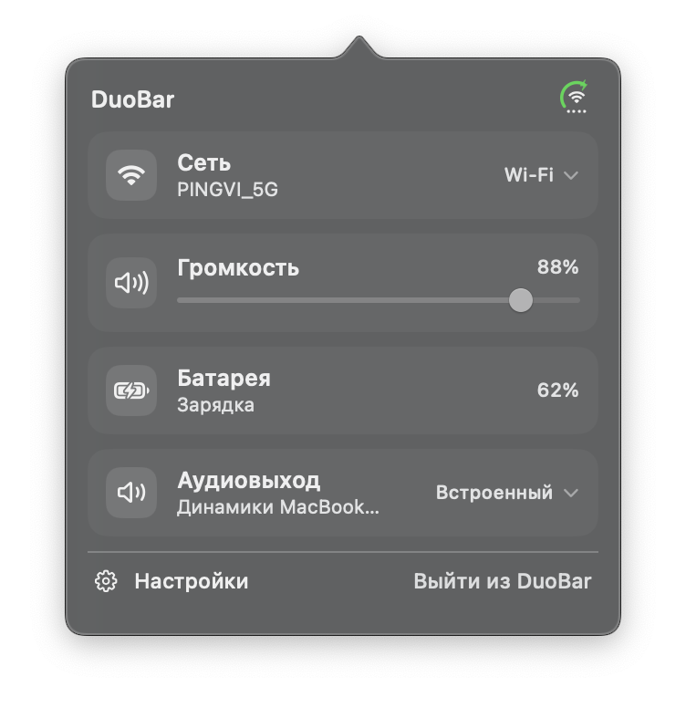
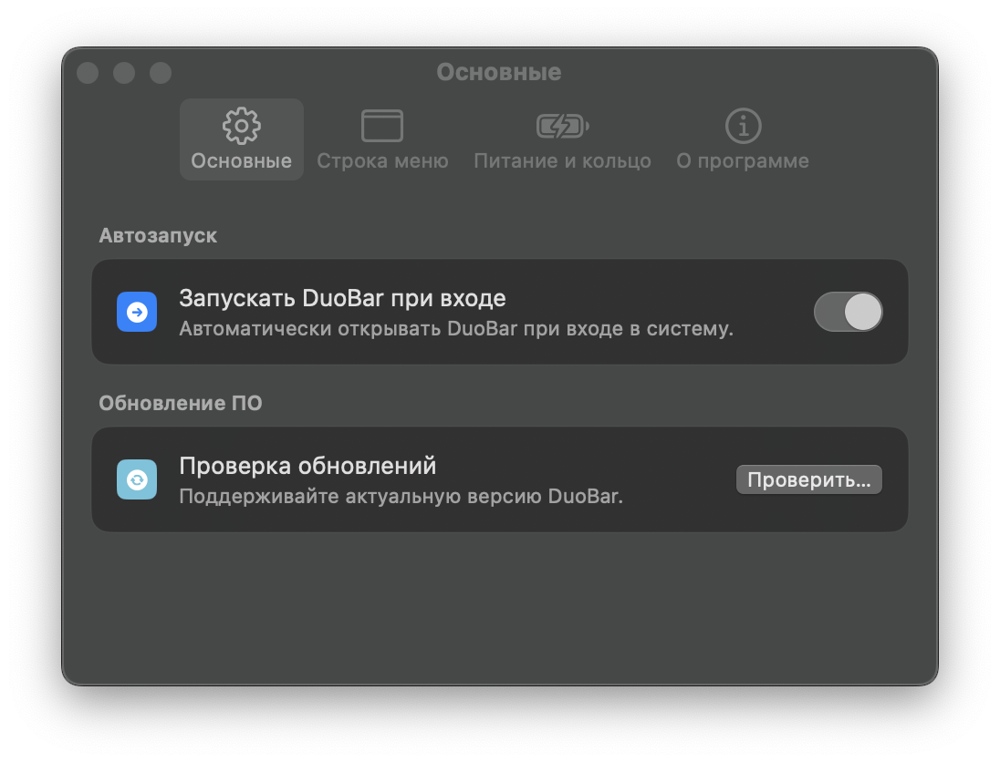
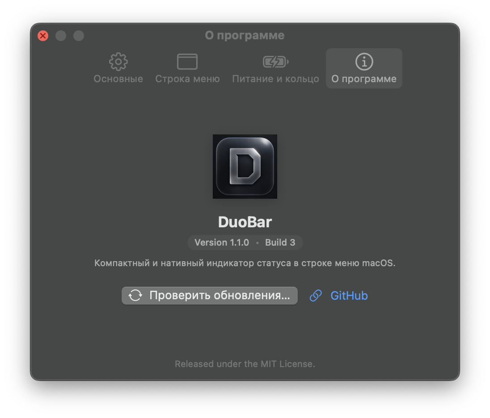

<div align="center">


# DuoBar

### The all-in-one macOS menu bar indicator for Battery, Network, and Volume — Reimagined.

**Three live states. One glyph. Zero menu bar clutter.**

[](https://github.com/vibe2code/DuoBar/releases/latest)
[](https://github.com/vibe2code/DuoBar/actions/workflows/build.yml)
[](https://github.com/vibe2code/DuoBar/actions/workflows/release.yml)
[](https://github.com/vibe2code/DuoBar/releases)
[-informational?style=for-the-badge)](https://github.com/vibe2code/DuoBar/releases)
[](https://github.com/vibe2code/DuoBar#--17-world-languages-supported)
[](LICENSE)

<br>

[**⬇️ Download Latest Release**](https://github.com/vibe2code/DuoBar/releases/latest) · [**✨ What's New**](#-comparison-original-duobar-vs-modern-duobar) · [**📖 Documentation**](#-installation) · [**💬 Report Issue**](https://github.com/vibe2code/DuoBar/issues)

<br>

<table align="center">
  <tr>
    <td align="center" width="50%">
      <b>Interactive Status Popover</b><br>
      <i>Wi-Fi picker, Audio output switcher, volume & battery</i><br><br>
      
    </td>
    <td align="center" width="50%">
      <b>Native macOS Frosted Glass Settings</b><br>
      <i>Vibrant translucency, live glyph preview & tabs</i><br><br>
      
    </td>
  </tr>
</table>

</div>

---

## ⚡ Overview

DuoBar adapts the unified 3-in-1 status concept for your Mac's menu bar. Instead of cluttering your menu bar with separate battery, Wi-Fi, and volume icons, DuoBar combines them into a single, elegant glyph:

* **Outer Ring:** Live Battery Ring on MacBooks (charge level, dynamic bolt, low-power states) or Adaptive Performance Ring on desktop Macs.
* **Center Glyph:** Active network indicator (Wi-Fi signal strength, Ethernet, or offline state) with dynamic AirPods connection animations.
* **Lower Dots:** Four live dots representing output volume.

Modern DuoBar elevates this visual concept into a **fully interactive, system-grade macOS utility** featuring direct network and audio switching, native frosted-glass settings, Sparkle automatic updates, and 17 localizations.

---

## ⚔️ Comparison: Original DuoBar vs. Modern DuoBar

| Feature / Capability | Original DuoBar (v1.0.0) | Modern DuoBar (vibe2code) | Impact & Improvements |
| :--- | :---: | :---: | :--- |
| **📶 Wi-Fi Network Picker** | ❌ None *(Static text)* | **✅ Full Interactive Picker** | Scans surrounding Wi-Fi networks in real-time via CoreWLAN, displays signal bars (3 tiers), security badges, and enables 1-click network connection with password dialog. |
| **🎧 Audio Output Selector** | ❌ None *(Static text)* | **✅ Interactive Switcher** | Direct Core Audio device enumeration. Switch output seamlessly between Built-in Speakers, AirPods, Bluetooth headsets, HDMI, and USB DACs right from the popover. |
| **🪟 Settings Window Design** | ⚠️ Basic Gray Form | **✅ Frosted Glass Translucency** | Native macOS Ventura/Sonoma/Sequoia styling using `NSVisualEffectView` (`.behindWindow`), translucent material cards, and transparent titlebar. |
| **👁️ Live Glyph Preview** | ❌ None | **✅ Live Settings Preview** | Interactive preview of the menu bar glyph inside the Settings window with real-time size adjustment. |
| **🌍 Localizations** | ⚠️ 3 Languages *(en, zh-Hans, zh-Hant)* | **✅ 17 World Languages** | Full native translations with auto system language detection: English, Russian, Ukrainian, Greek, German, French, Spanish, Italian, Portuguese (BR), Japanese, Korean, Chinese, Arabic, Hindi, Turkish, Polish. |
| **🔄 Auto-Updates** | ❌ None *(Manual download)* | **✅ Sparkle 2 + Ed25519** | Fully automated background updates signed with Ed25519 keys, hosted on GitHub Pages appcast feed. Includes in-app "Check for Updates..." button. |
| **🎨 App Icon & Branding** | ❌ Xcode Placeholder | **✅ High-Res Retina Icon** | Custom polished metallic dark icon (`AppIcon.icns` & 256×256 PNG) integrated into the `.app` bundle, Dock, and About window. |
| **⚙️ CLI Packaging** | ❌ Xcode IDE Only | **✅ Standalone `build-app.sh`** | Build, bundle, sign, and package a standalone `DuoBar.app` using `swift build` directly from the command line without opening Xcode. |
| **🤖 GitHub Actions CI/CD** | ❌ None | **✅ Automated CI & Releases** | Automated build verification on every commit/PR (`build.yml`), plus automated releases and appcast deployments (`release.yml`). |
| **📏 Menu Bar Sizing** | ⚠️ Static size | **✅ Scaling Slider** | Granular icon scaling control with real-time feedback to fit any display notch or resolution. |
| **🚀 Launch at Login** | ⚠️ Rudimentary | **✅ Native `SMAppService`** | Robust Ventura/Sonoma/Sequoia `SMAppService` integration with system approval status tracking. |

---

## 🌟 Key Innovations & Enhancements

### 📶 Interactive Wi-Fi Network Picker
No more opening System Settings or Control Center just to switch Wi-Fi networks. Clicking the Network item in the DuoBar popover reveals:
* Live scan of nearby Wi-Fi networks using macOS `CoreWLAN`.
* Visual signal strength indicators (Strong, Good, Weak).
* Security status indicators (WPA2/WPA3 lock glyphs).
* Active network checkmark and direct connection prompt for password-protected networks.

### 🎧 Seamless Audio Output Switcher
Quickly redirect your audio output on the fly:
* Dynamic enumeration of all available Core Audio output devices.
* Immediate output switching without latency.
* Smart recognition of connected AirPods and Bluetooth audio gear with temporary status animations.

### 🪟 Native Translucent macOS Settings
Designed to feel like an official Apple System Settings pane:
* **Frosted Glass:** Powered by `NSVisualEffectView` with `.behindWindow` blending and `.ultraThinMaterial` grouped cards.
* **Tabbed Interface:** Clean tabs for `General` (Launch at Login, Updates), `Menu Bar` (Icon scaling, ring styling), `Battery & Power` (Colors, low battery alerts), and `About`.
* **Live Glyph Preview:** See your customizations instantly as you tweak settings.

<p align="center">
  
</p>

### 🌐 17 World Languages Supported
DuoBar automatically adapts to your system's language on launch:

| Flag | Language | Flag | Language |
| :---: | :--- | :---: | :--- |
| 🇺🇸 | **English** (`en`) | 🇯🇵 | **日本語** (`ja`) |
| 🇷🇺 | **Русский** (`ru`) | 🇰🇷 | **한국어** (`ko`) |
| 🇺🇦 | **Українська** (`uk`) | 🇨🇳 | **简体中文** (`zh-Hans`) |
| 🇬🇷 | **Ελληνικά** (`el`) | 🇹🇼 | **繁體中文** (`zh-Hant`) |
| 🇩🇪 | **Deutsch** (`de`) | 🇸🇦 | **العربية** (`ar`) |
| 🇫🇷 | **Français** (`fr`) | 🇮🇳 | **हिन्दी** (`hi`) |
| 🇪🇸 | **Español** (`es`) | 🇹🇷 | **Türkçe** (`tr`) |
| 🇮🇹 | **Italiano** (`it`) | 🇵🇱 | **Polski** (`pl`) |
| 🇧🇷 | **Português (Brasil)** (`pt-BR`) | | |

### 🔄 Automatic Updates via Sparkle
* Built on the industry-standard **Sparkle 2** framework.
* Every release is cryptographically signed with **Ed25519 (EdDSA)**.
* Continuous appcast manifest hosted reliably via **GitHub Pages** (`https://vibe2code.github.io/DuoBar/appcast.xml`).
* Check for updates manually from Settings or let DuoBar notify you automatically when a new version is released.

---

## 🚀 GitHub Actions Automation

DuoBar features a robust CI/CD pipeline on GitHub Actions:

* **[Build CI (`build.yml`)](.github/workflows/build.yml):**
  * Automatically triggered on every `push` and `pull_request` to `main`.
  * Runs on `macos-15` runner.
  * Compiles release binaries, generates the `.app` bundle, validates code signing, and creates downloadable `DuoBar.zip` build artifacts.
* **[Release CI (`release.yml`)](.github/workflows/release.yml):**
  * Automatically triggered on git tags (e.g. `v1.1.0`) or manual workflow dispatch.
  * Generates cryptographically signed Sparkle appcast entries with Ed25519.
  * Publishes GitHub Releases with release notes and attachments.
  * Deploys updated `appcast.xml` and download portal to the `gh-pages` branch.

---

## 📥 Installation

### Direct Download
1. Download the latest `DuoBar.zip` from [**GitHub Releases**](https://github.com/vibe2code/DuoBar/releases/latest).
2. Unzip and drag `DuoBar.app` to your `/Applications` folder.
3. Launch **DuoBar**.

> [!NOTE]
> Because community builds are ad-hoc signed, macOS Gatekeeper may show a warning on first launch. If prompted, right-click `DuoBar.app` and select **Open**, or navigate to **System Settings → Privacy & Security → Open Anyway**.

---

## 🔨 Building from Source

### Prerequisites
* macOS 13.0+ (Ventura, Sonoma, Sequoia)
* Xcode 15+ or Swift 5.9+ Command Line Tools (`xcode-select --install`)

### Fast Build via Terminal
You can build and package a complete standalone `DuoBar.app` with a single command:

```bash
git clone https://github.com/vibe2code/DuoBar.git
cd DuoBar

# Build release and package into build/DuoBar.app
chmod +x ./tools/build-app.sh
./tools/build-app.sh
```

The output will be available at `build/DuoBar.app`.

### Using Xcode IDE
Open `DuoBar.xcodeproj` in Xcode, select the **DuoBar** target, and press **Cmd + R**.

---

## 🔒 Privacy & Permissions

* **100% Local Processing:** All battery, network, and audio data is processed strictly on-device.
* **Zero Telemetry:** No analytics, no tracking, and no third-party data collection.
* **Network Permissions:**
  * **Location Services:** macOS requires location permission for `CoreWLAN` to display Wi-Fi network names (SSIDs). Denying this permission will still allow DuoBar to display signal strength and interface status.
  * **Bluetooth:** Used via Core Audio to identify active AirPods and audio peripherals.

---

## 📄 License & Acknowledgements

* Licensed under the [MIT License](LICENSE).
* Re-engineered and expanded by [**vibe2code**](https://github.com/vibe2code).
* Original concept and foundation inspired by [DuoBar by Mikeli7666](https://github.com/Mikeli7666/DuoBar).
