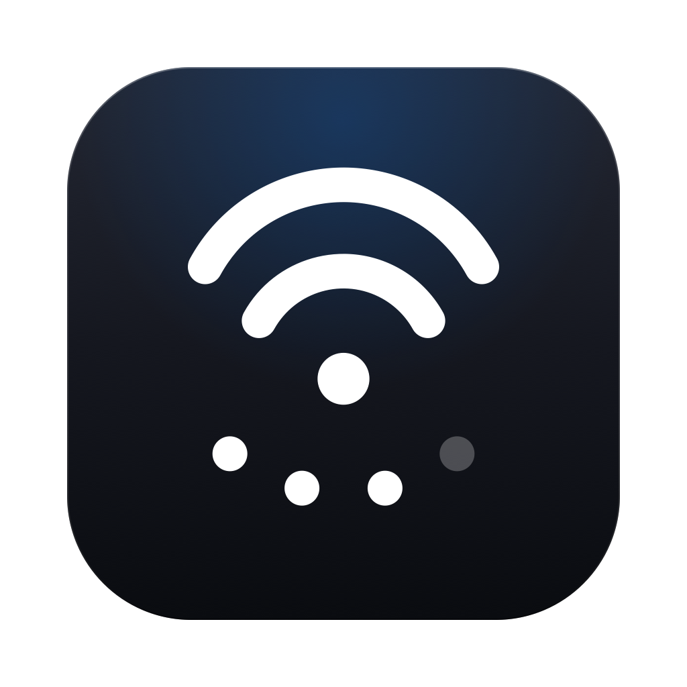
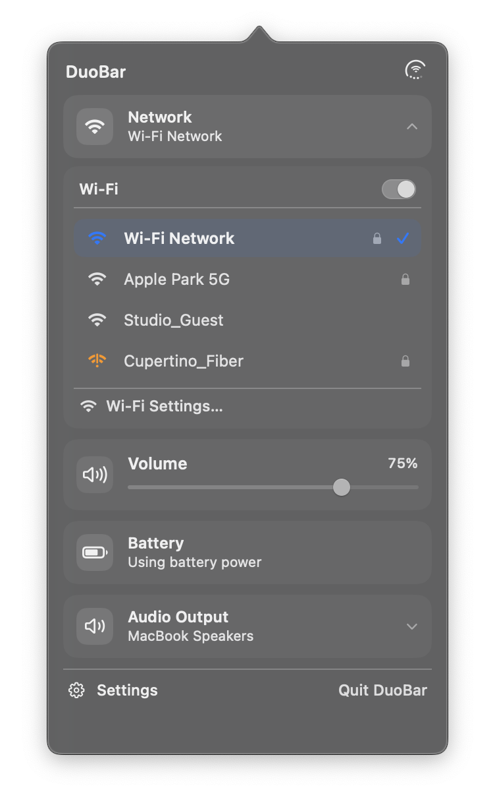
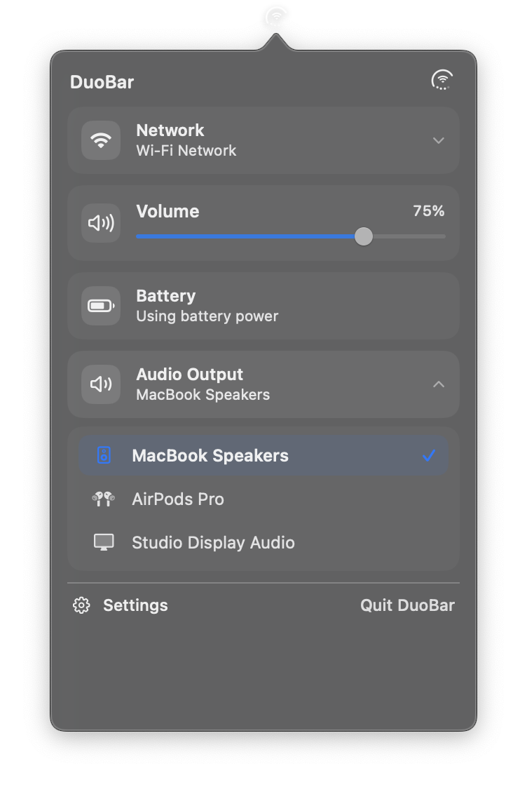
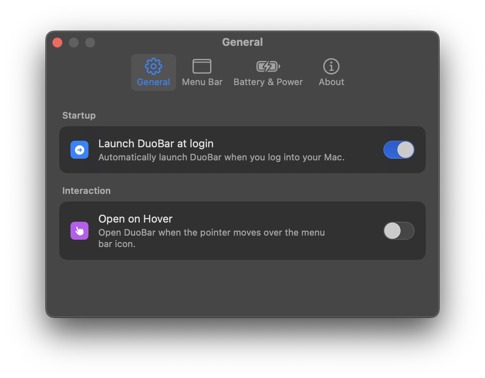

<div align="center">



# ReDuoBar

### The all-in-one macOS menu bar indicator for Battery, Network, and Volume — Reimagined.

**Three live states. One glyph. Zero menu bar clutter.**

[](https://github.com/vibe2code/ReDuoBar/releases/latest)
[](https://github.com/vibe2code/ReDuoBar/actions/workflows/build.yml)
[](https://github.com/vibe2code/ReDuoBar/actions/workflows/release.yml)
[](https://github.com/vibe2code/ReDuoBar/releases)
[-informational?style=for-the-badge)](https://github.com/vibe2code/ReDuoBar/releases)
[](https://github.com/vibe2code/ReDuoBar#--17-world-languages-supported)
[](LICENSE)

<br>

[**⬇️ Download Latest Release**](https://github.com/vibe2code/ReDuoBar/releases/latest) · [**🌐 Official Website**](https://vibe2code.github.io/ReDuoBar/) · [**✨ What's New**](#-comparison-original-duobar-vs-reduobar) · [**📖 Documentation**](#-installation) · [**💬 Report Issue**](https://github.com/vibe2code/ReDuoBar/issues)

<br>

<table align="center">
  <tr>
    <td align="center" width="33%">
      <b>Status Popover</b><br>
      <i>3-in-1 live system control</i><br><br>
      
    </td>
    <td align="center" width="33%">
      <b>Wi-Fi & Keychain Autofill</b><br>
      <i>Passwords, eye reveal & 1-click join</i><br><br>
      
    </td>
    <td align="center" width="33%">
      <b>Audio Output Switcher</b><br>
      <i>Core Audio peripheral switcher</i><br><br>
      
    </td>
  </tr>
  <tr>
    <td align="center" width="33%">
      <b>General & Startup</b><br>
      <i>Applications installer & auto-updates</i><br><br>
      
    </td>
    <td align="center" width="33%">
      <b>Menu Bar & Preview</b><br>
      <i>Scaling slider & live preview</i><br><br>
      
    </td>
    <td align="center" width="33%">
      <b>About & Updates</b><br>
      <i>Dynamic build info & Sparkle 2</i><br><br>
      
    </td>
  </tr>
</table>

</div>

---

## ⚡ Overview

ReDuoBar adapts the unified 3-in-1 status concept for your Mac's menu bar. Instead of cluttering your menu bar with separate battery, Wi-Fi, and volume icons, ReDuoBar combines them into a single, elegant glyph:

* **Outer Ring:** Live Battery Ring on MacBooks (charge level, dynamic bolt, low-power states) or Adaptive Performance Ring on desktop Macs.
* **Center Glyph:** Active network indicator (Wi-Fi signal strength, Ethernet, or offline state) with dynamic AirPods connection animations.
* **Lower Dots:** Four live dots representing output volume with instant mute support.

ReDuoBar elevates this visual concept into a **fully interactive, system-grade macOS utility** featuring:
- Wi-Fi network picker with macOS Keychain password autofill, show/hide password toggle, and password saving.
- Bluetooth device status and 1-click power toggle.
- Direct Core Audio output device selector and volume control.
- Sparkle 2 automatic updates toggle and Launch at Login support.
- Native frosted-glass settings and 17 world localizations.

---

## ⚔️ Comparison: Original DuoBar vs. ReDuoBar

| Feature / Capability | Original DuoBar (v1.0.0) | ReDuoBar (vibe2code) | Impact & Improvements |
| :--- | :---: | :---: | :--- |
| **📶 Wi-Fi Network Picker** | ❌ None *(Static text)* | **✅ Interactive + Keychain** | Real-time CoreWLAN scanning, signal tiers, security badges, **macOS Keychain password autofill**, **show/hide password toggle**, and **auto-save credentials**. |
| **⚡ Wi-Fi Power Control** | ❌ None | **✅ 1-Click Power Toggle** | Turn Wi-Fi module on or off instantly directly from the popover with clean single-toggle UI. |
| **🔵 Bluetooth Power & Devices** | ❌ None *(Static)* | **✅ Live Devices & Power Toggle** | Power toggle and scrollable device list with paired peripheral statuses. |
| **🎧 Audio Output Selector** | ❌ None *(Static text)* | **✅ Interactive Switcher** | Direct Core Audio device enumeration. Switch output seamlessly between Speakers, AirPods, Bluetooth headsets, HDMI, and USB DACs. |
| **🔊 Output Mute Toggle** | ❌ None | **✅ 1-Click Mute Control** | Mute or unmute system audio directly with live visual feedback on the lower glyph dots. |
| **👆 Open on Hover** | ❌ None | **✅ Instant Hover Reveal** | Optional toggle in Settings to open the status popover automatically when hovering over the menu bar icon. |
| **🔋 Laptop Adaptive Ring** | ❌ None | **✅ Smart 100% Handover** | When a MacBook is plugged in and reaches full charge, ReDuoBar automatically transitions the ring to display CPU / thermal load or display brightness. |
| **🪟 Settings Window Design** | ⚠️ Basic Gray Form | **✅ Frosted Glass Translucency** | Native macOS Ventura/Sonoma/Sequoia styling using `NSVisualEffectView` (`.behindWindow`), translucent material cards, and transparent titlebar. |
| **👁️ Live Glyph Preview** | ❌ None | **✅ Live Settings Preview** | Interactive preview of the menu bar glyph inside the Settings window with real-time size adjustment. |
| **🔄 Auto-Updates** | ❌ None *(Manual download)* | **✅ Sparkle 2 + Checkbox** | Background updates signed with Ed25519 keys, hosted on GitHub Pages appcast feed. Includes in-app "Automatically check for updates" toggle and manual check. |
| **🚀 Launch at Login** | ⚠️ Rudimentary | **✅ Native `SMAppService` + Helper** | Robust `SMAppService` integration with system approval tracking and 1-click "Install to Applications" helper for reliable execution. |
| **🌍 Localizations** | ⚠️ 3 Languages *(en, zh-Hans, zh-Hant)* | **✅ 17 World Languages** | Full native translations with auto system language detection: English, Russian, Ukrainian, Greek, German, French, Spanish, Italian, Portuguese (BR), Japanese, Korean, Chinese, Arabic, Hindi, Turkish, Polish. |
| **🎨 App Icon & Branding** | ❌ Xcode Placeholder | **✅ Custom Squircle Icon** | Custom polished dark metallic icon (`AppIcon.icns` & 1024×1024 Retina PNG) integrated into the `.app` bundle, Dock, and About window. |
| **⚙️ CLI Packaging** | ❌ Xcode IDE Only | **✅ Standalone `build-app.sh`** | Build, bundle, sign, and package a standalone `ReDuoBar.app` using `swift build` directly from the command line without opening Xcode. |
| **🤖 GitHub Actions CI/CD** | ❌ None | **✅ Automated CI & Releases** | Automated build verification on every commit/PR (`build.yml`), plus automated releases and appcast deployments (`release.yml`). |

---

## 🌟 Key Innovations & Enhancements

### 📶 Interactive Wi-Fi Network Picker & Keychain Integration
No more navigating through macOS System Settings or Control Center just to connect to a hotspot or toggle Wi-Fi:
* **Live Network Discovery:** Scans surrounding Wi-Fi networks in real-time using `CoreWLAN`.
* **Keychain Password Autofill:** Instantly recognizes known networks from macOS System Keychain and pre-fills saved passwords from ReDuoBar's private Keychain.
* **Show/Hide Password:** One-click eye toggle (`SecureField` ↔ `TextField`) to verify what you're entering.
* **Save Password Checkbox:** Automatically remembers network passwords securely in macOS Keychain upon connection.
* **Visual Status Indicators:** Multi-tier signal strength icons (Strong, Good, Weak) and security lock badges (WPA2/WPA3).
* **Instant Power Switch:** Turn your Mac's Wi-Fi interface ON or OFF with a single click.

### 🎧 Seamless Audio Output Switcher & Mute Control
Instantly redirect system audio without opening Control Center or Sound preferences:
* **Core Audio Integration:** Enumerates all active output devices (MacBook Speakers, AirPods, Bluetooth headphones, Studio Display, HDMI, and USB DACs).
* **Direct 1-Click Switching:** Select your output destination with instant feedback and active checkmark.
* **Instant Mute:** Click the volume icon or mute button to toggle silence with live feedback on the lower dots.
* **Per-Device Glyphs:** Tailored SF Symbols for AirPods Pro, over-ear headphones, displays, and built-in speakers.

### 👆 Open on Hover (Instant Hover Reveal)
Access your system status faster than ever:
* **Frictionless Interaction:** Open the ReDuoBar popover automatically simply by moving your mouse cursor over the menu bar icon.
* **Intelligent Tracking:** Built-in debounce and hover-tracking container prevents accidental triggers and unwanted flicker.
* **Customizable:** Toggle on or off anytime in **Settings → General**.

### 🔋 Laptop Adaptive Ring (100% Full Charge Handover)
Maximizing the utility of your menu bar space:
* **Smart Charge Transition:** When your MacBook is plugged in and reaches 100% battery, ReDuoBar automatically transitions the outer ring from battery status to an adaptive system performance monitor (display brightness, CPU load, or thermals).
* **Desktop Mac Support:** On iMac, Mac mini, and Mac Studio, ReDuoBar defaults to the adaptive system ring out of the box.

### 🪟 Native Translucent macOS Settings
Designed from the ground up to match modern macOS Sequoia and Sonoma styling:
* **Frosted Glass Vibrancy:** Powered by `NSVisualEffectView` with `.behindWindow` blending and `.ultraThinMaterial` grouped cards.
* **Structured Tabs:**
  * **General:** Launch at login (`SMAppService`) with 1-click Applications install helper, Sparkle auto-updates checkbox, and Open on Hover interaction.
  * **Menu Bar:** Granular icon scaling slider (Small to Large) with a **Live Simulated Menu Bar** preview, animation controls, and popover battery percentage toggle.
  * **Battery & Power:** Custom battery color-coding and low-power alert thresholds.
  * **About:** Dynamic version and build info, MIT License details, GitHub repository link, and centralized Sparkle update controls.

### 🌐 17 World Languages Supported
ReDuoBar automatically detects and adapts to your macOS system language on launch:

| Flag | Language | Flag | Language |
| :---: | :--- | :---: | :--- |
| 🇺🇸 | **English** (`en`) | 🇯🇵 | **日本語** (`ja`) |
| 🇷🇺 | **Русский** (`ru`) | 🇰🇷 | **한국어** (`ko`) |
| 🇺🇦 | **Українська** (`uk`) | 🇨🇳 | **简体中文** (`zh-Hans`) |
| 🇬🇷 | **Ελληνικά** (`el`) | 🇹🇼 | **繁體中文** (`zh-Hant`) |
| 🇩🇪 | **Deutsch** (`de`) | 🇸🇦 | **العربية** (`ar`) |
| 🇫🇷 | **Français** (`fr`) | 🇮🇳 | **हिन्दी** (`hi`) |
| 🇪🇸 | **Español** (`es`) | 🇹🇷 | **Türkçe** (`tr`) |
| 🇮🇹 | **Italiano** (`it`) | 🇵🇱 | **Polski** (`pl`) |
| 🇧🇷 | **Português (Brasil)** (`pt-BR`) | | |

---

## 📥 Installation

### Direct Download
1. Download the latest `ReDuoBar.zip` from [**GitHub Releases**](https://github.com/vibe2code/ReDuoBar/releases/latest).
2. Unzip and drag `ReDuoBar.app` to your `/Applications` folder.
3. Launch **ReDuoBar**.

> [!NOTE]
> Because community builds are ad-hoc signed, macOS Gatekeeper may show a warning on first launch. If prompted, right-click `ReDuoBar.app` and select **Open**, or navigate to **System Settings → Privacy & Security → Open Anyway**.

---

## 🔨 Building from Source

### Prerequisites
* macOS 13.0+ (Ventura, Sonoma, Sequoia)
* Xcode 15+ or Swift 5.9+ Command Line Tools (`xcode-select --install`)

### Fast Build via Terminal
You can build and package a complete standalone `ReDuoBar.app` with a single command:

```bash
git clone https://github.com/vibe2code/ReDuoBar.git
cd ReDuoBar

# Build release and package into build/ReDuoBar.app
chmod +x ./tools/build-app.sh
./tools/build-app.sh
```

The output will be available at `build/ReDuoBar.app`.

---

## 🔒 Privacy & Permissions

* **100% Local Processing:** All battery, network, audio, and keychain data is processed strictly on-device.
* **Zero Telemetry:** No analytics, no tracking, and no third-party data collection.
* **Network Permissions:**
  * **Location Services:** macOS requires location permission for `CoreWLAN` to display Wi-Fi network names (SSIDs).
  * **Keychain:** Saved Wi-Fi credentials are kept strictly in local macOS Keychain storage.
  * **Bluetooth:** Used via Core Audio to identify active AirPods and audio peripherals.

---

## 📄 License & Acknowledgements

* Licensed under the [MIT License](LICENSE).
* Re-engineered and expanded by [**vibe2code**](https://github.com/vibe2code).
* Original concept inspired by [DuoBar by Mikeli7666](https://github.com/Mikeli7666/DuoBar).
